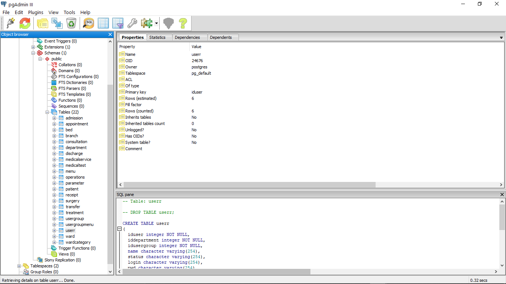
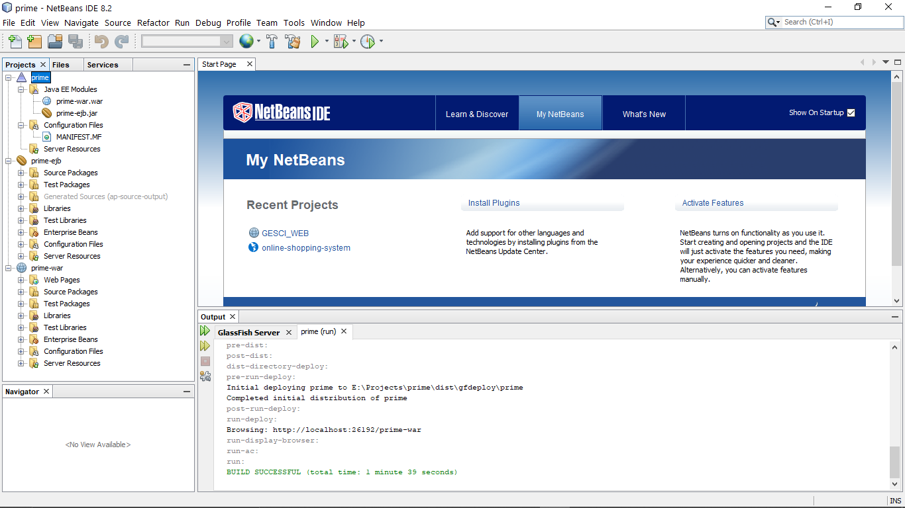
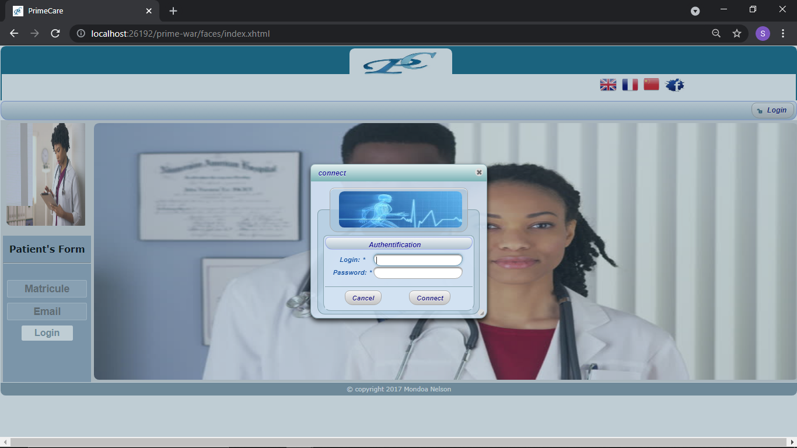
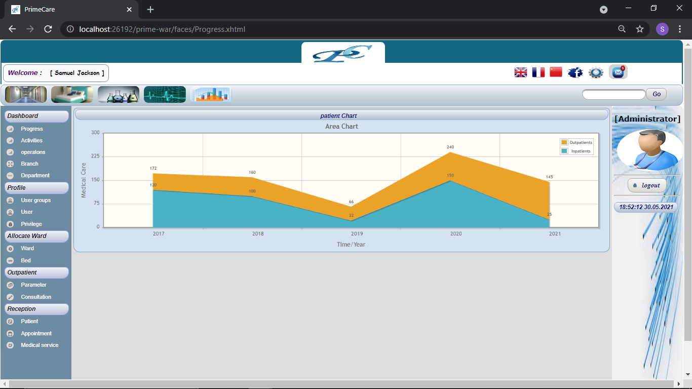
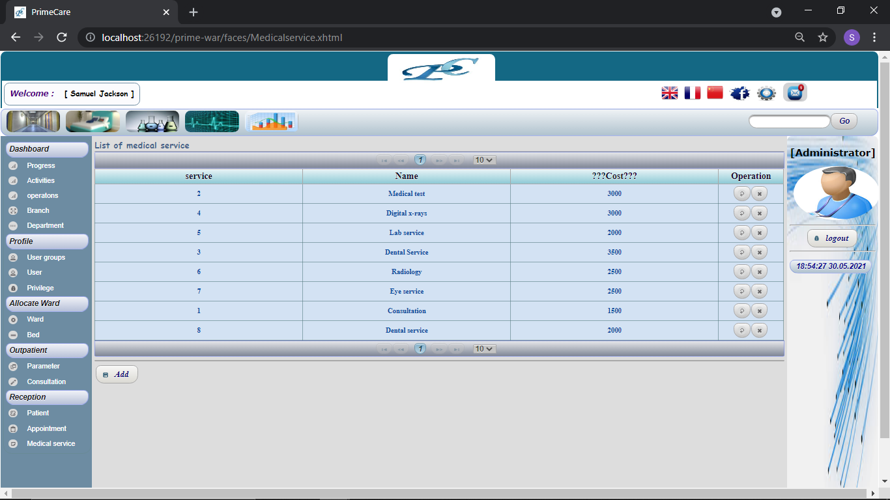
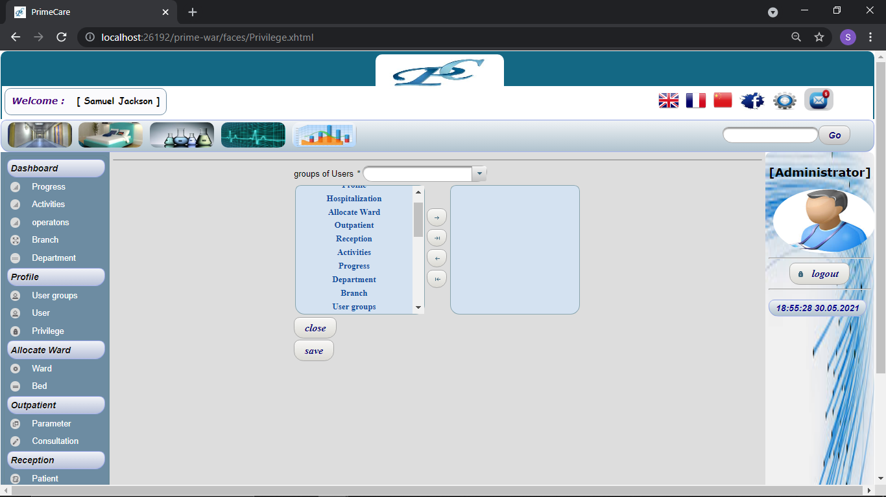
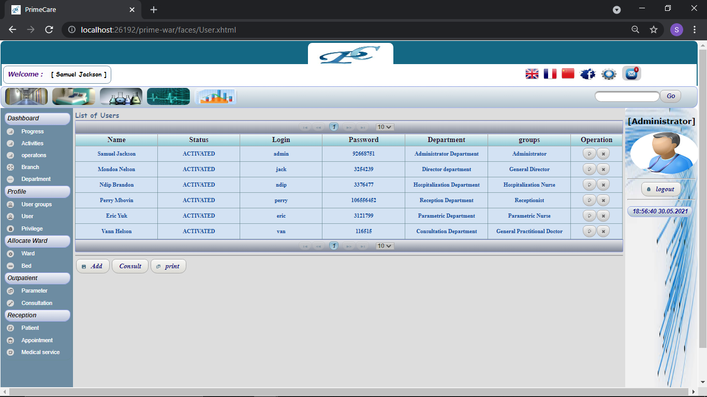

# primeCare

Author : Mondoa Nelson

PrimeCare is a Java Enterprise Web application to Manage a Hospital.

Modules
--------------------------

- Ward Management
- Bed Management
- Department Management
- Patient Management
- Branch Management
- Consultation Management
- Human Resource Management
- Account Management
- Laboratory Management

Tools
--------------------------

- PgAdmin
- Netbeans IDE
- Visual Paradigm
- Web Browser (google Chrome)

Technologies
--------------------------
- JAVA Enterprise Edition (JEE)
- JAVA Persistence API (JAP)
- JAVA Server Faces (JSF)
- PrimeFaces
- Postgresql

Overview
---------------------------

- Database

- Code

- Authentication

- DashBoard

- Account

- Privileges

- Medical Service

